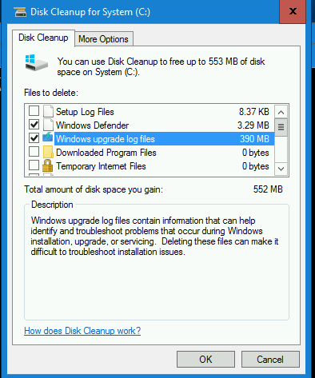

Role Name: Cleanmgr - Disk cleanup for system drive
=========

Run Disk Cleanup tool silently on Windows Server systems to free up disk space on system drive by removing unused:

    Temporary Windows and Internet files    
    Downloaded program files    
    Recycle Bin items    
    Applications or optional Windows components   
    WinSxS (Windows component store)    
    Files from a previous Windows installation (e.g. C:\Windows.log)     
    Windows upgrade log files    
    Setup Log files

Requirements
------------

Kerberos is configured on Ansible controller node to allow user authentication to the domain that VM belongs to.

Role Variables
--------------

   `` drive: "{{ ansible_facts['env']['SystemDrive'] }}" ``       

Example Playbook
----------------

    - hosts: servers
      roles:
         - { role: cleanmgr }

License
-------

BSD

Author Information
------------------

Narcis Serbanescu (narcis.serbanescu@gmail.com)

