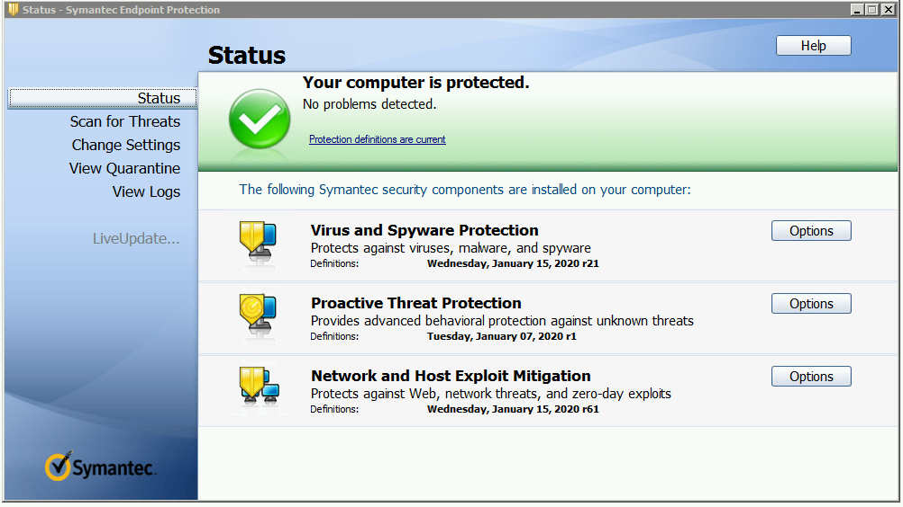

Role Name: sdelete
=========

Symantec Endpoint Protection Client installations and registration on Windows Platforms    

Requirements
------------

Kerberos is configured on Ansible controller node to allow user authentication to the domain that VM belongs to.      
SEP management server exists in the network so that SEP client can register.

Role Variables
--------------

Few variables are declared in vars/main.yml like:   
   `` src: C:\win_upgrade``       
   `` scripts_location: "{{ role_path }}/files" ``      
   `` drive: "{{ ansible_facts['env']['SystemDrive'] }}"``    

Dependencies
------------

    dependencies:
    - role: work_dir
    - role: 7zip_install only for Windows Server 2008 R2 cases where no other unzip option exists

Example Playbook
----------------

    - hosts: servers
      roles:
         - { role: sep_install, when: "ansible_facts['os_family'] == 'Windows'" }

License
-------

BSD

Author Information
------------------

Narcis Serbanescu (narcis.serbanescu@gmail.com)

